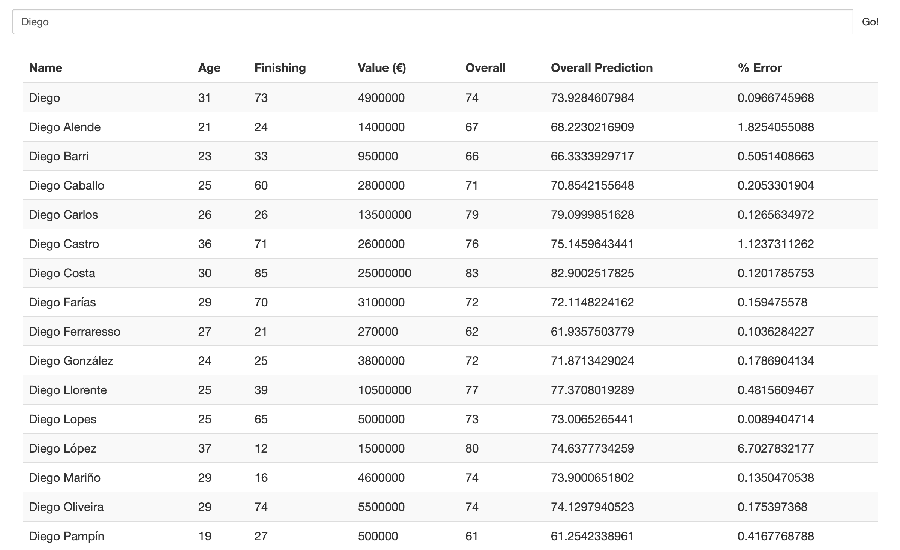

# Machine Learning Model to Predict Fifa 20 Overall Player Ratings

This project creates a predictive model that is able to guess how good a soccer player is based on in-game attributes. 

## Getting Started
This project has a predict.py that 
1. Takes preprocessing steps to prepare the data.
2. Uses prints to show a descriptive analysis of the data to better understand the characteristics.
3. Train different machine learning models using scikit-learn. (scikit-learn splits data into testing and training sets also). 
4. Evaluate the learned models by using unseen data (testing set).
5. Compare them until a good model is found using mean squared error (MRE) and variance score. 
6. Use candidate model to predict overall player scores

### Prerequisites

* [Python 3](https://www.python.org/download/releases/3.0/) - Used for data processing, preparing, learning, and predicting
* [Angular](https://angular.io/) - Used for web app to search and view players and predictions

### End Result
Resulted in a good candidate model. Embedded model in front-end AngluarJS web application that allows the user to search players and compare how good the players are against the system’s predictions seen in screenshot below.

### Future Work
In the future I want to explore using more attributes to come up with a stronger model since Fifa 20 uses 70+. Also I want to experiment with different regression models for prediction (this project used linear, ridge, and support vector regression for the model) to improve the model. 

